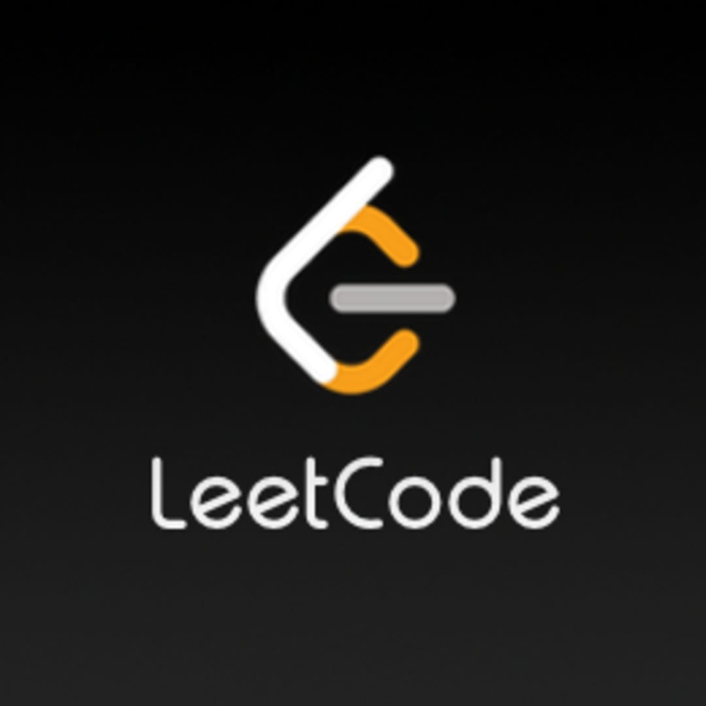

### Hi there 👋

**How to reach me : 🌎**

   

<!--
Here are some ideas to get you started:

- 🔭 I’m currently working on ...
- 🌱 I’m currently learning ...
- 👯 I’m looking to collaborate on ...
- 🤔 I’m looking for help with ...
- ⚡ Fun fact: ...
-->
